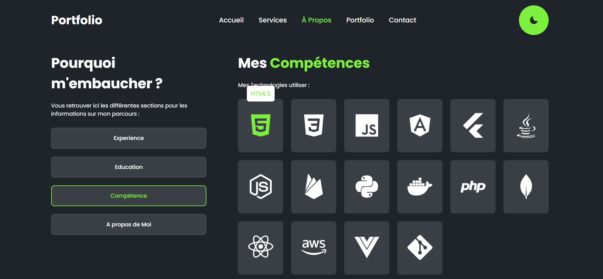

<<<<<<< HEAD
# 👨‍💻 Portfolio - Alain Datouo

Bienvenue sur mon portfolio de développeur full stack & DevOps !  
Je suis étudiant ingénieur à l'ESIEA, passionné par le développement web et mobile, l’automatisation, et le cloud computing.

🔗 [Voir le portfolio en ligne](](https://github.com/MBIDA3/portfolio.git)

---

## 🚀 À propos de moi

Je suis en 3ᵉ année d'école d'ingénieur en informatique, spécialisation **DevOps / Cloud / Full Stack**.  
J’ai travaillé sur plusieurs projets concrets, incluant des applications mobiles, des dashboards web, et des déploiements automatisés sur AWS.

---

## 🛠️ Compétences techniques

- **Front-end** : Angular, React.js, Vue.js, HTML, CSS, JavaScript  
- **Back-end** : Node.js, Express.js, Django, Flask, Laravel, SpringBoot, .NET  
- **Cloud & DevOps** : AWS, Docker, Linux, Terraform, GitHub Actions  
- **Autres** : Git, Bash, Firebase, Java, Python, C#

---

## 💼 Expérience

### 🔹 Développeur Web & Mobile — LAO Sarl (04/2024 - 07/2024)
- Application mobile de suivi de pression artérielle
- Dashboard Angular + API REST
- Automatisation = -30% de temps de traitement
- dévelopement d'une API  de gestion des congés cas de LAO sarl

### 🔹 Analyste Fonctionnel — Orange Cameroun (04/2023 - 06/2023)
- Portail de gestion d’offres télécoms
- Maquettes Figma + Rédaction de User Stories
- Analyse métier et entretiens utilisateurs

### 🔹 Développement plateforme web — IME (03/2023 - présent)
- Site pour le bureau des étudiants de l'université

---

## 🧠 Formation

- 🎓 **ESIEA - Paris** : Ingénierie informatique (DevOps / Cloud / Web)
- 🎓 **IME  - Douala** : 1re et 2e années en classe préparatoire ingénieur,
  durant lesquelles j’ai également obtenu un BTS en génie logiciel à l’IME
   Bonamossadi de Douala.

---

## 🌟 Réalisations clés

- **+30% efficacité** sur traitement de données médicales via automatisation
- **App QR codes** personnalisée pour 50 entreprises
- **CI/CD AWS** avec GitHub Actions, Flask, Terraform, EC2, RDS

---

## 📫 Me contacter

- 💼 [LinkedIn](www.linkedin.com/in/christian-embolo-mbida-6549342a9)
- 💻 [GitHub]([https://github.com/AlainDanp](https://github.com/MBIDA3))
- ✉️ cmbida38@gmail.com

---
=======
# portfolio
>>>>>>> c8a6160c32d191765db5a50e2c18d9587804d111
